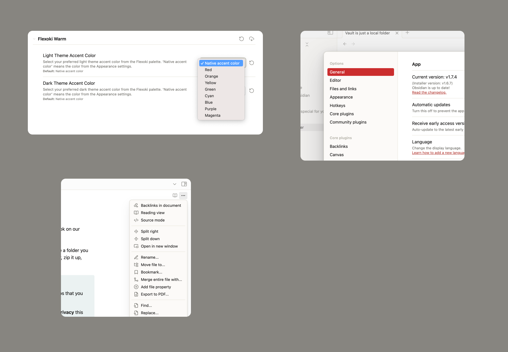

# Flexoki Warm

A slightly modified version of the excellent [Flexoki theme](https://github.com/kepano/flexoki-obsidian) for Obsidian.

## Changes

- In light mode, backgrounds are not tinted yellow. All background colors are reverted to the default Obsidian theme colors, except for:
- ...the sidebar and context menu backgrounds, which have a slightly warmer tint.
- Style settings for overriding the accent color with one of the [Flexoki palette](https://stephango.com/flexoki) accent colors.

## Screenshots

